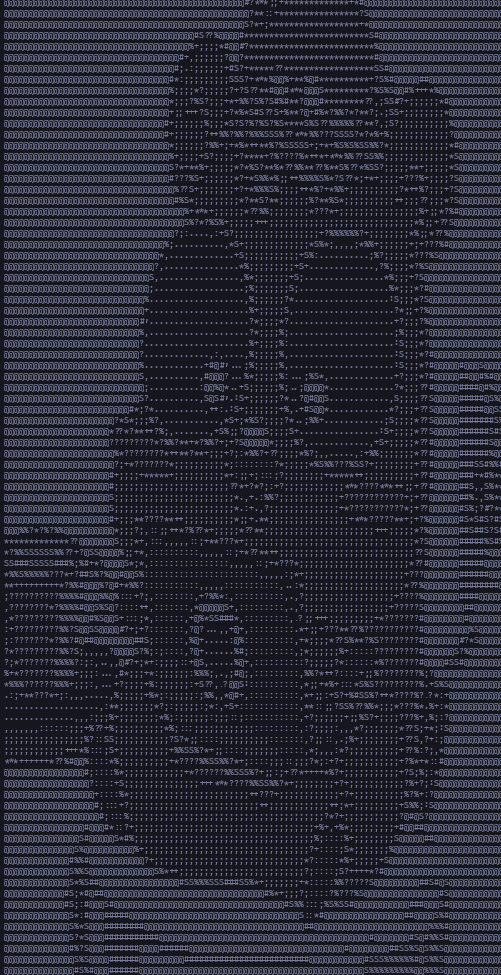

# Image2ASCII 🖼️➡️🔤

Convert images to ASCII art using Python! 🐍

## Description ℹ️

Image2ASCII is a Python script that converts images into ASCII art. It reads an image file, resizes it, converts it to grayscale, and then maps the pixel values to ASCII characters. The resulting ASCII art is displayed on the console and saved to a text file. 🎨

## Features ✨

- Convert images to ASCII art.
- Resize images to adjust the width.
- Convert images to grayscale for better representation.
- Save the generated ASCII art to a text file. 💾

## Requirements 🛠️

- Python 3.x
- Pillow library (`pip install Pillow`)

## Usage 🚀

1. Clone the repository:

   ```bash
   git clone https://github.com/Kernel-rb/Image2ASCII.git
   ```
2. Navigate to the project directory:

   ```bash
   cd Image2ASCII
   ```
3. Run the script:

   ```bash
   python image2ascii.py
   ```
4. Follow the prompts to enter the path to the image you want to convert.
5. View the generated ASCII art on the console. 👀
6. Find the ASCII art saved in the file named `asciiArt.txt` in the same directory.

## Sample 🖼️



## Contributing 🤝

Contributions are welcome! If you have any ideas, enhancements, or bug fixes, feel free to open an issue or submit a pull request. 🎉
